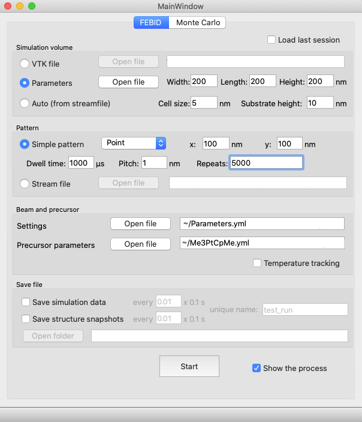

=========================
FEBID Simulation package
=========================

:Author: Alexander Kuprava & Michael Huth
:Maintainer: Alexander Kuprava
:Contact: alexkuparava@gmail.com
:URL: https://github.com/mrcheatak/febid_py
:Documentation: http://febid-py.readthedocs.io
:PyPi: |version|
:ReadTheDocs: |docs|

|build| |dependencies| |contributors|

.. |version| image:: https://badge.fury.io/py/febid.svg
    :target: https://badge.fury.io/py/febid
.. |docs| image:: https://readthedocs.org/projects/febid-py/badge/?version=latest
    :target: https://febid-py.readthedocs.io/en/latest/?badge=latest
    :alt: Documentation Status
.. |contributors| image:: https://img.shields.io/badge/contributions-welcome-brightgreen.svg?style=flat
    :target: https://github.com/mrchetak/febid_py/issues
.. |build| image:: https://github.com/MrCheatak/FEBID_py/actions/workflows/build_orig.yml/badge.svg?style=flat
    :target: https://github.com/MrCheatak/FEBID_py/actions/workflows/build_orig.yml
.. |dependencies| image:: https://img.shields.io/librariesio/github/mrcheatak/FEBID_py
   :target: https://libraries.io/github/mrcheatak/FEBID_py
    :alt: Libraries.io dependency status for FEBID_py repo

What is FEBID Simulation?
--------------------------
FEBID stands for Focused Electron Beam Induced Deposition – a direct-write nanofabrication process
similar to 3D printing.
It uses volatile organometallic molecules (precursor) as material and a controlled electron beam
to selectively deposit material on a substrate.

Simulation provides capabilities of running the process virtually by providing material properties
and deposition conditions. The result is a 3D model of the fabricated structure along with data collected
during the simulation.

The package features an separate Monte Carlo electron beam — matter interaction module.
By using the same input data, it is possible to inspect electron scattering profile and heat source *in-situ*.

Installation
---------------
The simulation requires Python 3.9 or later.

Package is available via PyPi: :code:`pip install febid`

Alternatively, it can be installed directly from GitHub via pip, although that will require compilation of some modules:

:code:`pip install git+https://github.com/MrCheatak/FEBID_py`

*Tip*: Linux user may need to manually install vtk9(visualisation) and pyqt5(interface)
with the system package manager as they may have to be explicitly added to the system for support.

Running the first simulation
-----------------------------
In order to run the first simulation, *Parameters.yml* and *Me3PtCpMe.yml* parameter files in the
`Examples <https://github.com/MrCheatak/FEBID_py/tree/master/Examples>`_ folder are needed.
As the installation finishes, run :code:`python -m febid`, which will show the main control panel:

There are three main setup steps that are essential for the simulation: space, pattern and parameters of the
beam and deposition material. Further instructions will configure a simulation on a 200x200 nm substrate
with a stationary 5s exposure of a 30keV 0.15nA beam deposition using the Me3PtCpMe precursor.

Space:
    Firstly, a simulation volume domain has to be created. The simplest case is a clean substrate.
    Choose *Parameters* option and specify 200x200x200 nm
    dimensions with 5 nm cell size and 10 nm substrate. This will define a cubic simulation domain divided into voxels
    with 5 nm edge length. Finally, a 20 nm layer of substrate material (Au) is laid at the bottom.

Pattern:
    Next, pattern has to be defined for the controlled beam. Choose *Simple patterns* and select *Point* from the drop-down
    menu. This option will fix the beam at a point specified by X and Y parameters, set both of them to 100 to position
    the beam at the center of the substrate. The time that the beam will spend at that point is defined by *dwell time*
    and *repeats* parameters. Lets set a 5 s exposure by setting them to 1000 and 5000 correspondingly.
    A beam is configured now to stay at the (100,100) point for 5 s.

Beam and precursor:
    Finally, open *Parameters.yml* for *Settings* and *Me3PtCpMe.yml* for *Precursor parameters*. The first one
    specifies the beam parameters and precursor flux, the second provides precursor material properties.

Lastly, uncheck all the saving options and enable *Show the process* to watch the growth in real
time and hit **Start**.

Documentation
--------------
Full documentation with interface guide and manual, algorithm explanations and API can be found on
`readthedocs <http://febid-py.readthedocs.io>`_

Usage
-------

In case of usage of this package for scientific purposes and publication, we kindly ask to cite:

`Kuprava A., Huth M. Fast and Efficient Simulation of the FEBID Process with Thermal Effects.
Nanomaterials, 2023, 13, 858 <https://doi.org/10.3390/nano13050858>`_