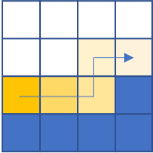
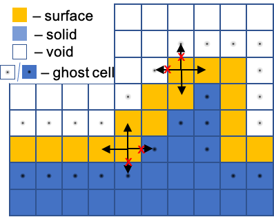
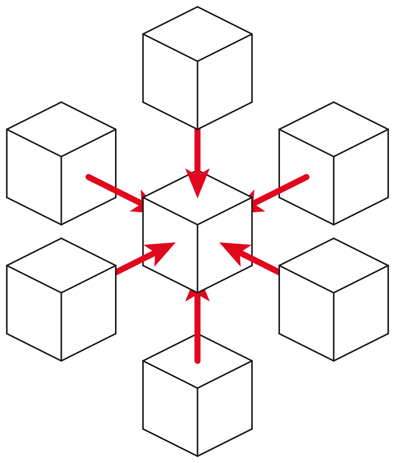

Diffusion
============================
Surface diffusion plays an important role in precursor coverage replenishment at the beam interaction region (BIR).

    Diffusive flow

In the discretised simulation volume, diffusion occurs on a monolayer of cells that separates solid and empty cell
domains. It is the same cell layer that contains information about surface precursor coverage.

Solution of the diffusion equation is a subroutine of the reaction-diffusion equation solution. Each time the solution
occurs, it outputs a profile of local precursor changes induced by the diffusion process and then added to the precursor
coverage profile.

Ghost cells
""""""""""""""""""""""""""""""""""

In order to enable diffusion exclusively along the surface a so-called ‘ghost cell’ method is used.
The thin layer of surface cells is ultimately contained between the void and solid cells.
The solid and void cells that neighbor a surface cell are marked as ghost cells, encapsulating the whole surface.
During the application of the stencil operator, the ghost cells mimic the value in the current cell. This artificially
creates a condition of zero concentration difference and consequently zero diffusive flux.

Diffusion is described via a parabolic PDE equation and thus
requires a special numerical solution.

Characteristic time of the diffusion makes it feasible to use the simplest approach – the FTCS scheme.

Numerical solution
"""""""""""""""""""
The diffusion equation:

:math:`\frac{\partial T}{\partial t}=D\nabla^2T`,

where:
    :math:`D` is surface diffusion coefficient :math:`\left[ \frac{nm^2}{s} \right ]`

    :math:`T` is temperature [K]

which is resolved in 3D space:

:math:`\frac{\partial T}{\partial t}=
D\left(\frac{\partial^2T}{\partial x^2}+\frac{\partial^2T}{\partial y^2}+\frac{\partial^2T}{\partial z^2}\right)`

The solution occurs in a discretized volume domain, where the finest spacial step
along each axis is :math:`\Delta x,\Delta y,\Delta z`. Temperature in each cell is addressed by it's index along each
axis `i,j,k`. The FTCS scheme can then be described as follows:

:math:`\frac{\partial T}{\partial t}=D\left(\frac{T_{i-1,j,k}-2T_{i,j,k}+T_{i+1,j,k}}{\Delta x^2}+
\frac{T_{i,j-1,k}-2T_{i,j,k}+T_{i,j+1,k}}{\Delta y^2}+
\frac{T_{i,j,k-1}-2T_{i,j,k}+T_{i,j,k+1}}{\Delta z^2}\right)`

Partial derivatives are averaged from the current and neighboring cells along a single axis.

For a case with a cubic cell, where :math:`\Delta x=\Delta y=\Delta z`, the expression can be simplified:

:math:`\partial T=D\partial t\left(\frac{T_{i-1,j,k}+T_{i+1,j,k}+T_{i,j-1,k}
+T_{i,j+1,k}+T_{i,j,k-1}+T_{i,j,k+1}-6T_{i,j,k}}{\Delta x^2}\right)`

where:
    :math:`D` is surface diffusion coefficient :math:`\left[ \frac{nm^2}{s} \right ]`

    :math:`T_{i,j,k}` is temperature in the given cell [K]

    :math:`\partial t` is the time step or time resolution, [s]

Using the derived expression, the state of the system at the next time step can be derived from the current state.

    3D Stencil operator

From analysing the expression, it is evident that it sums every neighbor and subtracts the value of the central cell.
Such operation, that is applied to all cells in the same manner is called a `stencil`.

The Fourier stability criterion for the FTCS scheme is:

:math:`F=\frac{2D\Delta t}{\Delta x^2}`,

for 3D space :math:`F<\frac{1}{6}` yielding maximum stable time step:

:math:`\Delta t=\frac{\Delta x^2}{6D}`,

while semi-implicit Crank-Nicholson and implicit Euler methods are unconditionally stable.

    Nevertheless Crank-Nicholson is unconditionally stable, meaning it works for any time step, it may suffer
    oscillations. At the same time, implicit Euler is immune to oscillations, but has only 1st-order accuracy in time.

