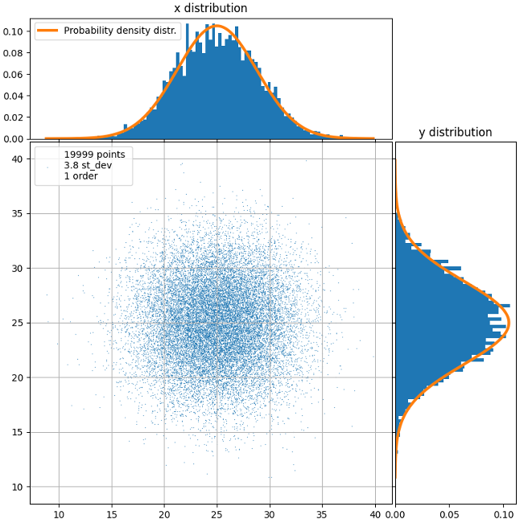
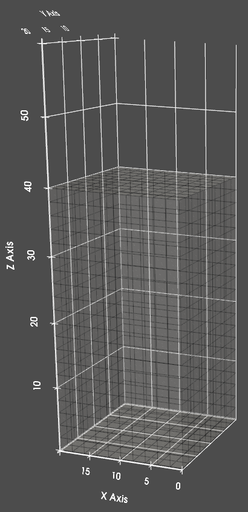
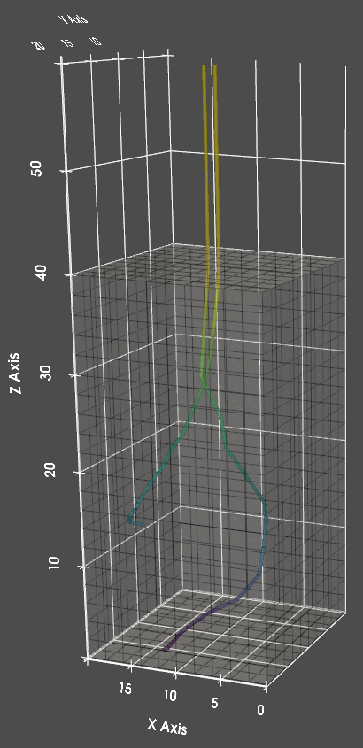
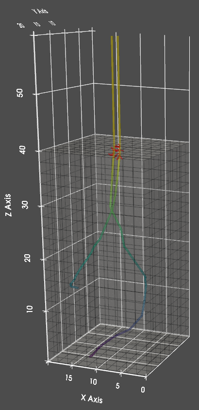
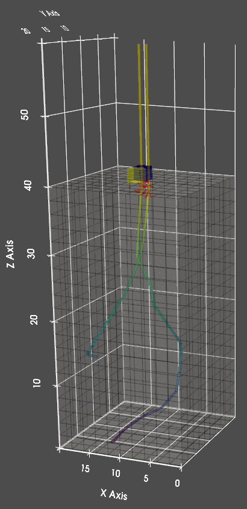
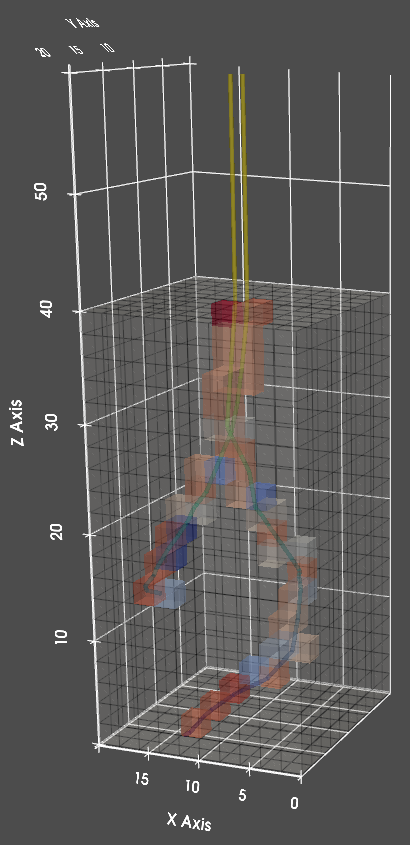

Monte Carlo module
==================

The Monte Carlo module realises electron beam – matter interaction.
There are two results, that are eventually transferred to the deposition module.
The first one is secondary electron flux profile, the second is distribution of the volumetric heat sources
in the solid or beam heating power.

There are a total of 5 stages that the simulation consists of:

#. Primary electron scattering
#. Secondary electron emission
#. Surface electron flux estimation
#. Primary electron energy deposition
#. Secondary electron energy deposition

1. Primary electron scattering
""""""""""""""""""""""""""""""""

    A total of 20000 generated electrons
    on a 50x50 grid with 3.8 standard
    deviation. Histograms reflect equatorial
    distributions.

At this step, scattering of the primary electrons is simulated, resulting in a collection of electron trajectories
coupled with energy losses along the trajectory.

Initially, a number of electrons are generated around the beam position according to the Gaussian distribution:

The scattering process occurs in a simulation volume domain of a predefined material.

Each electron initially has the energy of the beam :math:`E_0`, that is continuously lost as the electron propagates
through the solid. The trajectory of an electron consists of a number of consequent scattering points, that are
characterised by the electron position and energy. Together, a number of trajectories represent the spacial scattering
of the emitted electrons.

At each scattering point, based on the electron energy, the scattering angle and
the free path length are calculated based on `random values` from a normal distribution. After this, the trajectory
is extended by an additional segment. The trajectory proceeds likewise until an electron reaches a cut-off energy
or escapes the simulation volume domain:

    Simulation volume domain subdivided into cubic cells.

    Two electron trajectories in the simulation volume. Coloring corresponds to electron energy.

-------------

2. Electron trajectory discretisation
""""""""""""""""""""""""""""""""""""""

    Red lines are SE vectors in the vicinity of the surface.

Here, the generated trajectories are subdivided and secondary electrons are emitted based on the energy loss on those
subsegments.

Firstly, the trajectories of primary electrons are finely (less then a nm) subdivided into subsegments. Each subsegment
corresponds to the energy lost by an electron at this distance :math:`E`. Based on that energy, the number of emitted
secondary electrons is calculated. Electrons are emitted from from the beginning of the subsegment and the emission
direction is random. The free path that secondary electrons may travel is fixed for a given material, thus all the
emission vectors as assigned the same length. The result at this step is a collection of secondary electron vectors,
stemming from primary electron trajectories.

At this stage, those vectors are as well filtered. All SEs that cannot reach the surface due to being buried too deep
in the solid are separated from those that have their emission sources in the vicinity of the surface.

-------------

3. Surface electron flux estimation
""""""""""""""""""""""""""""""""""""

    Surface SE flux, lighter color corresponds to higher flux rate.

Now, the secondary electron vectors are converted into surface secondary electron flux.

Each vector may or may not reach the surface depending on its position and direction. To test each vector for crossing
with the surface, they are followed along and each cell that they traverse through is checked. If a traversed cell
appears to be a surface cell, the number of emitted secondary electron that the vector 'carries' is added to that
surface cell. Performing such routine on all the vectors results in accumulation of secondary electrons in the surface
cells and yields a surface secondary electron flux.

-------------

4. Beam heating power estimation
"""""""""""""""""""""""""""""""""

    Beam heating power distributed per cell, the higher the power the more red is the cell.

Finally, the power of the beam heating is calculated at this step.

The energy of primary electrons is spent as well on Joule heating. Each electron, as it travels through the solid,
deposits a fraction of the lost energy into the solid, resulting in heating of the solid medium.
Due to the fact that the solid is discretised into cubic cells, the heating power is a collective of cells traversed
by primary electrons with energy deposited in them or a collection of volumetric heat sources.

Each trajectory is followed along to determine the distance traveled inside the cells they traverse. Traversed cells
are then added the energy lost by that electron proportional to that distance. This results in a spatially resolved
volumetric heat sources distribution, that follow electron trajectories.

In the end, the resulting distribution is added all the secondary electrons, that were buried too deep. Those electrons
are considered scattered and contribute to the heating process.

------------

Secondary electron emission energy (:math:`\varepsilon`):
    It is the energy required to launch a cascade of secondary electrons.
    While these values are tabulated for most of the elements in [Lin2005]_, compound energies shall be
    averaged volumetrically, i.e. AB compound(amorphous):

    :math:`\overline{\varepsilon}=V_A\cdot\varepsilon_A+V_B\cdot\varepsilon_B`,

    where
        :math:`V_A` and :math:`V_B` are volume fractions of the phases

        :math:`\varepsilon_A` and :math:`\varepsilon_B` are emission activation energies

.. [Lin2005] Lin Y., Joy D., A new examination of secondary electron yield data, Surf. Interface Anal. 2005, 37, 895–900

